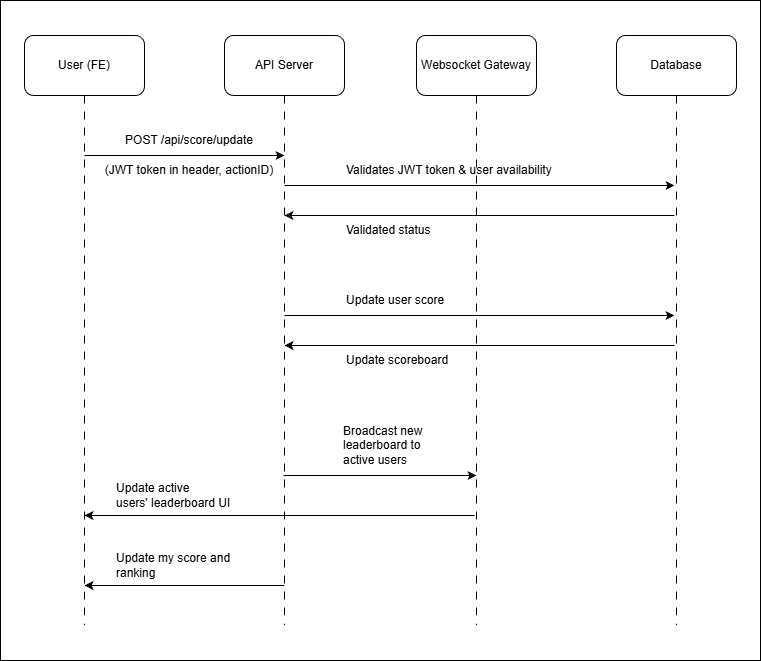

# Live Scoreboard API Module

## Overview

This module provides an **API service** for a live-updating scoreboard system. It handles **secure user score updates**, maintains **leaderboard ranking**, & supports **real-time broadcasting** of score changes to all connected clients.

## Purposes
* Provide **real-time updates** to all clients when scores change.
* Prevent **unauthorized score manipulation** (fraud prevention).
* Ensure **scalability** & **performance** for high traffic scenarios.

## System Components

| Component          | Description                                                 | Recommended Tech |
| ------------------ | ----------------------------------------------------------- | ---------------- |
| **Score Service**  | Updating & fetching scores.                                 | Node.js          |
| **Authentication** | Authenticate user via JWT auth header before score updates. | JWT              |
| **WebSocket**      | Broadcasts real-time score updates to connected clients.    | Socket.io        |
| **Database**       | Stores historical & user score data.                        | PostgreSQL       |

---

## API Specification

### 1. `POST /api/score/update`

Updates a user’s score after completing a valid action.

#### Request Headers

```js
"authorization": "Bearer <jwt_token>"
```

#### Request Body
```json
{
  "actionId": "string"
}
```

#### Response

```json
{
  "success": true,
  "newScore": 3000,
  "newRank": 1
}
```

#### What does it do?

1. Authenticate user via auth header.
2. Increment user’s score in the database.
3. Re-calculate rankings and update leaderboard.
4. Broadcast the new leaderboard state via WebSocket.

---

### 2. `GET /api/score/top-10`

Fetches the top 10 users & their scores.

#### Response

```json
{
  "leaderboard": [
    { "userId": 1, "score": 3000 },
    { "userId": 2, "score": 2999 },
    ...
  ],
  "lastUpdatedAt": "2025-11-04T14:00:00Z",

}
```

#### What does it do?

1. Authenticate user via auth header.
2. Returns top 10 users and their scrores.

---

### 3. WebSocket Channel

#### Endpoint

`/ws/scoreboard`

#### Message Example

```json
{
  "event": "leaderboard_updated",
  "data": [
    { "userId": 1, "score": 3000 },
    { "userId": 2, "score": 2999 },
    ...
  ]
}
```

#### What does it do?

* Broadcasts when a user’s score changes.
* Clients subscribed receive live leaderboard updates.

---

## Flow Diagram


---

## Future Improvements

* Add event logs for debugging & analytics.
* Support batched score updates.
* Caching scoreboard with Redis.
* Improve security & anti-abuse mechanisms (User rate limiting, Replay protection using unique action ID)
